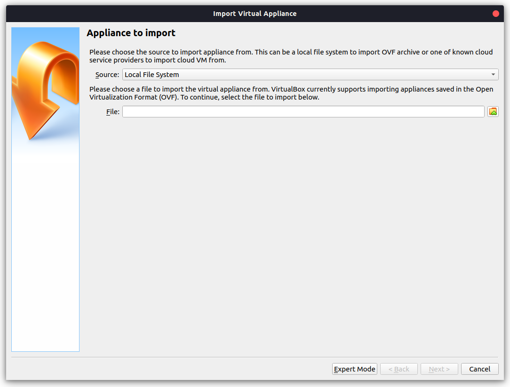

# GNS 3
GNS3 adalah aplikasi simulator jaringan (Graphic Simulator Network) berbasis GUI yang di rilis pada tahun 2008. Dengan GNS3 kita bisa mensimulasikan perangkat asli baik dengan bantuan emulator ataupun teknologi virtualisasi.

# Panduan Instalasi GNS 3
Pastikan dalam komputer anda sudah terinstall `VirtualBox` atau `VMware`.
* ## File yang diperlukan :
  * ### 1. GNS 3
    - Untuk mendownload file master GNS3 silahkan kunjungi link berikut [Download GNS 3](https://www.gns3.com/software/download)
  - ### 2. FIle Server (VirtualBox / VMware)
    - Untuk mendownload file server GNS3 silahkan kunjungi link berikut [Download File Server](https://www.gns3.com/software/download-vm)

# Persiapan Server
Ekstrak file server yang sudah didownload.

Buka softwere yang akan kalian gunakan sebagai server, disini saya menggunakan `VirtualBox` 

Klik menu `file` kemudian pilih `import`

Kemudian klik icon kecil di kanan kolom file lalu cari file server yang sudah di ekstrak tadi (ekstensi `.ova`).

Klik tombol next

Kemudian klik import dan tunggu hingga proses selesai

Setelah selesai klik file -> Host Newtowk Manager

Klik `create` dan enable dhcp server

Setelah selesai setting Host Network Manager, jalankan server yang sudah di import

# Instalasi Di OS Windows
  * Klik 2 kali pada file master yang sudah didwonload
  
  
  * Klik Next atau Agre saja pada setiap pop up yang muncul
  
  
  
  
  
  
  
  
  * Untuk penawaran solarwinds klik saja `no`
  
  
  

# Setup GNS 3
* Setelah instalasi selesai maka akan muncul pop up untuk memilih server. Disini saya akan menggunakan server virtual machine
  
  
  
  

    Jika ada pesan error silahkan klik saja ok

* Pada pop up selanjutkan pilih Virtual Box
  
  
  

* Setup untuk GNS 3 sudah selesai.
  
# Menambahkan Router Mikrotik Di GNS 3
Secara default GNS 3 tidak menyediakan router, untuk itu kita harus menginput router secara manual

Silahkan Download file Router Mikrotik pada link berikut 

[Router Mikrotik](https://mikrotik.com/download)

Scroll kebawah sampai menemukan Cloud Hosted Router

Kemudian download dengan cara mengklik icon save pada kolom `Raw disk image`

Ekstrak file tersebut

Kembali Ke GNS 3, pilih menu edit -> preferences kemudian klik new pada kolom `Qemu VMs`

Pilih `Run this Qemu VM on the GNS3 VM`

Beri nama untuk router yang akan ditambahkan

Next

Next

Pada pop up ini pilih `New Image` kemudian klik browse... untuk mencari file router mikrotik yang sudah diekstrak (file yang berekstensi `.img`)

Setelah selesai klik edit

Pada tab `General Setting` ubah kategori menjadi `Routers`

Pada tab `Network` silahkan ubah pada kolom `Adapters` untuk menambahkan port pada router sesuai kebutuhan anda. Disini saya mengubah router saya menjadi 4 port yang tersedia.

Setelah selesai silahkan klik ok maka Router Mikrotik akan muncul pada workspace GNS3

  
    