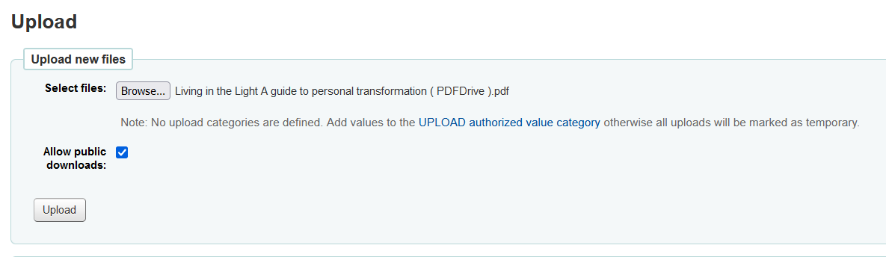

# Cara Upload File Di Koha ILS

- ### Pada halaman staff klik `tools > upload`

    
    

- ### Klik `browse` untuk memilih file yang akan di upload kemudian centang `Allow public downloads`

    
    

- ### Salin Hashvalue kemudian gabung dengan `http://ils-opac.pilkommedia.edu/cgi-bin/koha/opac-retrieve-file.pl?id=`
    link ini akan menjadi online resource pada saat membuat record.

# Membuat Record Katalog Baru
- ### `cataloging > new record`

    

- ### Pada halaman MARC record ada banyak kolom yang diisi, silahkan isi sesuai kebutuhan
- ### Pada section ke 8 isi kolom `Uniform Resource Identifier` dengan link yang kita gabung dengan hashvalue sebelumnya

    

- ### Setelah itu klik save