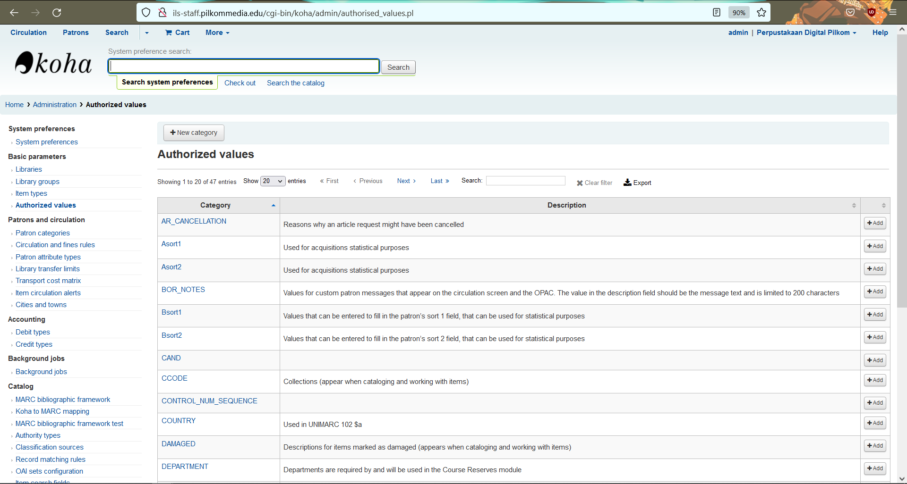
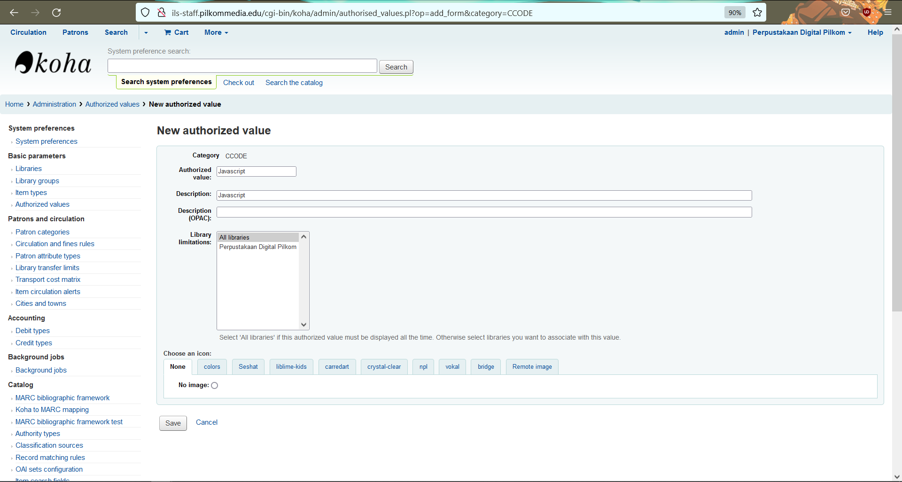
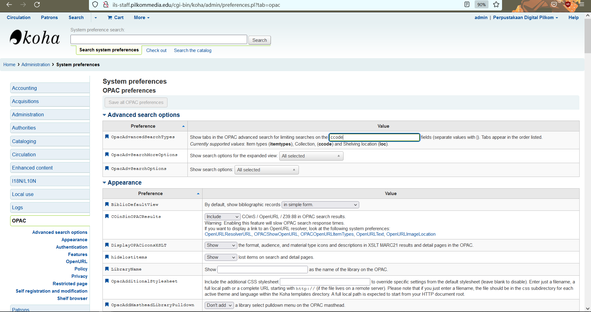
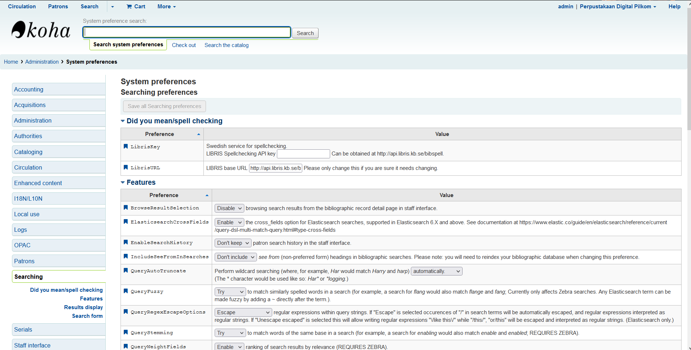
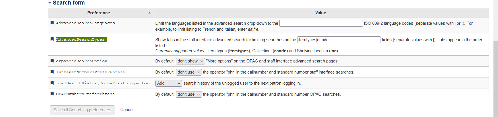

# Membuat koleksi item
- ##  Koha Administration > Authorized values 

    

- ## klik add pada kolom `ccode`
    - isi sesuai keperluan

    

    pada contoh diatas saya membuat koleksi item untuk `javascript`
- ## klik save

# Setting OPAC agar pada Advanced search muncul koleksi item
-  ## koha Administration > System preferences > OPAC

     

    - Tambahkan `ccode` pada kolom  `OpacAdvancedSearchTypes` 

# Setting agar bisa search berdasarkan koleksi item
-  ## koha Administration > System preferences > Searching
     

    - Tambahkan `ccode` pada kolom   `AdvancedSearchTypes`  

    
